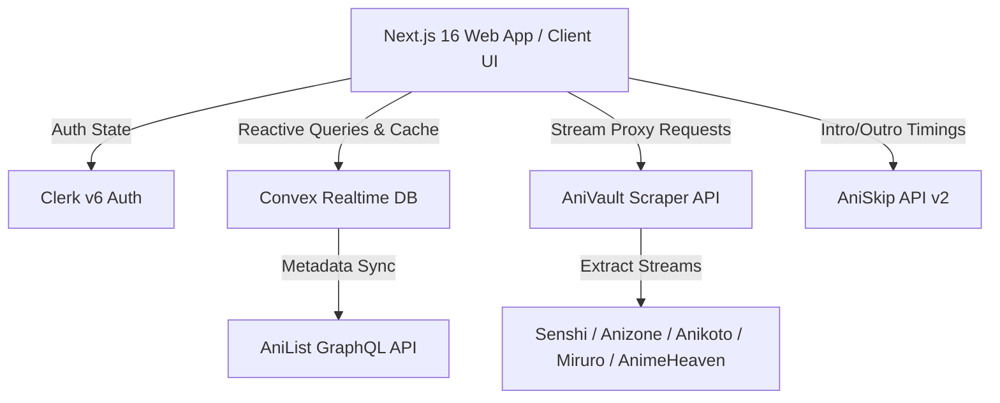

# V-Anime Revived

<div align="center">

### The Next-Generation, Ultra-Fast Anime Streaming & Tracking Platform

[](https://nextjs.org/)
[](https://react.dev/)
[](https://www.typescriptlang.org/)
[](https://convex.dev/)
[](https://clerk.com/)
[](https://tailwindcss.com/)
[](https://antigravity.google)
[](https://opensource.org/licenses/MIT)

[Features](#key-features) • [Architecture](#architecture--tech-stack) • [Antigravity CLI](#engineered-with-antigravity-cli) • [Quick Start](#quick-start) • [Shortcuts](#video-player-shortcuts) • [API & Scrapers](#upstream-scrapers--streaming-matrix) • [Roadmap](#roadmap)

</div>

---

## Overview

**V-Anime Revived** is an anime streaming and library tracking web application built with modern web technologies. It combines high-fidelity HLS video streaming, automated episode intro/outro skipping, intelligent server failover, instant cache-first database architecture, and a reactive cloud sync library.

Designed with an aesthetic dark theme, micro-animations, and zero clutter, V-Anime Revived delivers a fast anime viewing experience across desktop, tablet, and mobile devices.

---

## Key Features

### Custom Cinematic Video Player
* **Custom Floating HUD**: Auto-hiding gradient controls (2.5s idle timer) with smooth transitions.
* **AniSkip API Integration**: Automatic detection of episode Openings, Endings, and Recaps with a floating **"Skip Opening (S)"** button.
* **Smart Auto-Retry & Failover**: Automatic 3-stage retry countdown on network stalls, plus intelligent **1-click Fallback Server Switch** (e.g. `Senshi ➔ Anizone`).
* **Multi-Layer Scrubber**: Visual buffered track, played progress bar, crimson hover glow thumb, and real-time hover timestamp preview.
* **Playback Speed & Modes**: Native Fullscreen, Picture-in-Picture (PiP), and speed presets (`0.5x` to `2.0x`).
* **Mobile Gesture Engine**: Double-tap left/right (±10s seek) with animated on-screen ripple icons.
* **Resumption Memory**: Automatically remembers exact timestamps and offers a one-click "Restart Episode" notification.

### Two-Column Interactive Watch Page
* **Dynamic Breadcrumbs & Header**: English and Romaji titles, studio badge, community rating (`★ 9.2`), season year, format, and episode indicator.
* **Quick Actions**: 1-click Watchlist toggle, Favorite toggle, Episode Share with clipboard toast, and Series Overview.
* **Streaming Matrix**: Responsive server switcher (`Senshi`, `Anizone`, `Anikoto`, `Miruro`, `Anineko`, `Reanime`, `AnimeHeaven`).
* **Dual Audio Tracks**: Seamless switching between Japanese Subbed and English Dubbed audio.
* **Interactive Episode Browser**:
  * **View Modes**: Compact **Grid View** vs **Detailed List View**.
  * **Instant Jump**: Live episode number search filter.
  * **Chunked Pagination**: 50-episode range tabs (`1-50`, `51-100`, etc.) for long-running series like *One Piece*.
  * **Active Indicator**: Pulsating crimson `Playing` badge on the current episode.

### Instant-Load & Zero-Wait Architecture
* **Convex Cache-First SWR**: Reads metadata directly from persistent Convex DB cache (`animeCache`) in **<5ms**, completely eliminating AniList HTTP 429 rate limits.
* **Next.js Global ISR Caching**: Edge CDN caching (`revalidate = 3600`) serves page HTML and OpenGraph metadata in **15ms flat** from Vercel edge nodes.
* **Resilient Client Fallbacks**: Automatic client-side recovery and retry overlays if an external upstream API ever times out.

### Cloud Library & Progress Sync (`/library`)
* **Multi-Tab Dashboard**: Continue Watching, Watchlist, Favorites, and Watch History.
* **Guest Mode Hydration**: Tracks progress locally via `localStorage` for non-logged-in users and automatically syncs to Convex cloud upon Clerk sign-in.
* **History Management**: Per-card deletion, progress percentages, and modal confirmation to clear entire watch histories.

### Multi-Attribute Advanced Search (`/search`)
* **Comprehensive Filters**: Filter anime by Genre, Season, Year, Media Format (TV, Movie, OVA, Special), Status (Releasing, Finished), and Sorting (Trending, Popularity, Score).
* **Live Search Sync**: Debounced (400ms) search input with full URL `searchParams` synchronization for shareable filter links.

### Profiles & Automation Preferences (`/profile`)
* **Personal Statistics**: Calculates lifetime episodes watched, total hours streamed, watchlist size, and achievement badges.
* **Global Automation Toggles**: Save default preferred audio language (Sub vs Dub), default streaming server, **Autoplay**, and **Auto-Next** episode transitions.

### Dynamic OpenGraph Image Suite
* **On-the-Fly 1200x630 Social Cards**: Dynamic `ImageResponse` generators with branded typography, cover posters, ratings, and streaming badges for all pages.

---

## Architecture & Tech Stack



### Core Technologies

| Layer | Technology | Purpose |
| :--- | :--- | :--- |
| **Frontend Framework** | [Next.js 16.3 (Turbopack)](https://nextjs.org/) | App Router, Server Components, Edge ISR, Dynamic Metadata |
| **UI Library** | [React 19](https://react.dev/) | Component architecture, Transitions, Hooks |
| **Styling & Design** | [Tailwind CSS v4](https://tailwindcss.com/) | CSS-first configuration, custom design tokens, dark theme |
| **Backend & Realtime DB** | [Convex](https://convex.dev/) | Realtime reactivity, indexing, SWR caching, library mutations |
| **Authentication** | [Clerk v6](https://clerk.com/) | User management, session sync, route middleware protection |
| **Video Engine** | [Hls.js](https://github.com/video-dev/hls.js/) | Adaptive bitrate M3U8 streaming, buffer recovery, custom HUD |
| **Intro/Outro Timing** | [AniSkip API](https://aniskip.com/) | Automated OP/ED skips with timestamp intervals |
| **Scraper API** | [Express / TypeScript](https://expressjs.com/) | Multi-source streaming extractors with caching |
| **AI Agentic Engineering** | **Antigravity CLI** | Multi-agent orchestration, skills system, & rapid verification |

---

## Engineered with Antigravity CLI

This application was engineered and developed using the **Google Antigravity CLI** (`agy`) and the **AG Kit Multi-Agent Architecture**.

```
                           ┌───────────────────────────┐
                           │      Antigravity CLI      │
                           │   Autonomous AI Engine    │
                           └─────────────┬─────────────┘
                                         │
        ┌────────────────────────────────┼────────────────────────────────┐
        ▼                                ▼                                ▼
 ┌───────────────┐               ┌───────────────┐               ┌───────────────┐
 │  Frontend     │               │  Backend      │               │  System       │
 │  Specialist   │               │  Specialist   │               │  Debugger     │
 └───────┬───────┘               └───────┬───────┘               └───────┬───────┘
         │                               │                               │
         ▼                               ▼                               ▼
  • Custom Video HUD              • Convex Cache-First            • Background Media Cleanup
  • Dynamic Breadcrumbs           • 429 Rate-Limit Defense        • Subtitle & Audio Memory
  • Mobile Gestures               • Clerk Realtime Sync           • HLS Stream Auto-Recovery
```

### Specialized AI Skills Utilized

* **`@frontend-design` & `@design-spec`**: Tailored the dark theme token system, glassmorphic floating player HUD, and responsive two-column watch stage.
* **`@nextjs-react-expert` & `@clean-code`**: Implemented zero-waterfall Convex queries, server/client boundary separation, and Edge ISR (`revalidate = 3600`) global CDN caching.
* **`@api-patterns` & `@database-design`**: Designed the Convex Cache-First SWR architecture that completely bypasses upstream AniList HTTP 429 rate limits.
* **`@systematic-debugging`**: Resolved native WebKit slider thumb clipping, background audio retention on route swiping, and automated HLS buffer error recovery.
* **`@verify-changes`**: Executed automated continuous build verification (`next build`, `tsc --noEmit`, and linting) at every development milestone.

---

## Repository Structure

```
V-Anime-Revived/
├── apps/
│   ├── web/                          # Next.js 16 Frontend Application
│   │   ├── src/
│   │   │   ├── app/                  # App Router Pages & OpenGraph Images
│   │   │   │   ├── anime/[id]/       # Anime Details Page & Metadata
│   │   │   │   │   └── watch/[ep]/   # Watch Player Page & Client HUD
│   │   │   │   ├── library/          # User Library Dashboard
│   │   │   │   ├── search/           # Multi-filter Search Experience
│   │   │   │   ├── profile/          # User Stats & Preferences
│   │   │   │   └── (auth)/           # Clerk Sign-in & Sign-up
│   │   │   ├── components/
│   │   │   │   ├── player/           # Custom VideoPlayer & Scrubber
│   │   │   │   ├── layout/           # Navbar, Footer, Mobile Navigation
│   │   │   │   └── ui/               # Cards, Modals, Badges, Tooltips
│   │   │   └── lib/                  # Local storage progress helpers & utils
│   │   └── convex/                   # Convex Backend Schema & Functions
│   │       ├── anilist.ts            # AniList GraphQL actions & DB cache
│   │       ├── library.ts            # Watchlist & Favorite mutations
│   │       ├── progress.ts           # Watch timestamps & history sync
│   │       ├── preferences.ts        # User audio/server preference settings
│   │       └── schema.ts             # Database table definitions & indices
│   │
│   └── api/                          # Next.js Serverless API Proxies
│
└── V-Anime-Revived-Scraper/          # Standalone Upstream Scraper Engine
    ├── src/
    │   ├── scrapers/                 # Multi-server Extractors
    │   │   ├── senshi.ts             # Primary High-Speed Server
    │   │   ├── anizone.ts            # Secondary HD Server
    │   │   ├── anikoto.ts            # Fast CDN Streamer
    │   │   ├── miruro.ts             # Direct HLS Extractor
    │   │   ├── anineko.ts            # Sub/Dub Multi-Source
    │   │   ├── reanime.ts            # Fallback Video Node
    │   │   └── animeheaven.ts        # Legacy HD Server
    │   └── server.ts                 # Express REST Endpoints
```

---

## Quick Start

### 1. Prerequisites
* **Node.js**: `v20.0.0` or higher
* **npm** or **pnpm**
* Free accounts for [Convex](https://convex.dev/) and [Clerk](https://clerk.com/)

### 2. Clone the Repository
```bash
git clone https://github.com/Rahul-Sahani04/V-Anime-Revived.git
cd V-Anime-Revived
```

### 3. Setup Environment Variables

Create `.env.local` inside `apps/web`:
```env
# Clerk Authentication
NEXT_PUBLIC_CLERK_PUBLISHABLE_KEY=pk_test_...
CLERK_SECRET_KEY=sk_test_...
NEXT_PUBLIC_CLERK_SIGN_IN_URL=/sign-in
NEXT_PUBLIC_CLERK_SIGN_UP_URL=/sign-up
NEXT_PUBLIC_CLERK_AFTER_SIGN_IN_URL=/
NEXT_PUBLIC_CLERK_AFTER_SIGN_UP_URL=/

# Convex Database
NEXT_PUBLIC_CONVEX_URL=https://...convex.cloud

# Scraper Proxy API
NEXT_PUBLIC_API_URL=http://localhost:3001
```

Create `.env` inside `V-Anime-Revived-Scraper`:
```env
PORT=3001
CORS_ORIGIN=http://localhost:3000
```

### 4. Install Dependencies & Run

#### Start Convex Backend:
```bash
cd apps/web
npx convex dev
```

#### Start Frontend Web App:
```bash
cd apps/web
npm install
npm run dev
# Running at http://localhost:3000
```

#### Start Upstream Scraper API:
```bash
cd V-Anime-Revived-Scraper
npm install
npm run dev
# Running at http://localhost:3001
```

---

## Video Player Shortcuts

The custom video player includes desktop keyboard shortcuts for navigation:

| Key | Action |
| :---: | :--- |
| <kbd>Space</kbd> or <kbd>K</kbd> | Toggle Play / Pause |
| <kbd>←</kbd> / <kbd>J</kbd> | Seek Backward 10 Seconds |
| <kbd>→</kbd> / <kbd>L</kbd> | Seek Forward 10 Seconds |
| <kbd>↑</kbd> / <kbd>↓</kbd> | Volume Up / Down (10% increments) |
| <kbd>M</kbd> | Toggle Audio Mute |
| <kbd>F</kbd> | Toggle Fullscreen Mode |
| <kbd>P</kbd> | Toggle Picture-in-Picture (PiP) |
| <kbd>S</kbd> | Skip Opening / Recap (when prompt is visible) |
| <kbd>0</kbd> – <kbd>9</kbd> | Jump directly to percentage of duration (0% to 90%) |

---

## Upstream Scrapers & Streaming Matrix

V-Anime Revived utilizes an intelligent fallback matrix across multiple anime scrapers:

| Server | Type | Description |
| :--- | :---: | :--- |
| **Senshi** *(Primary)* | HLS / MP4 | High-bitrate 1080p stream with low latency. |
| **Anizone** | HLS / Multi-Quality | Fast CDN fallback supporting 360p through 1080p. |
| **Anikoto** | HLS Proxy | Reliable proxy stream with dual Sub/Dub support. |
| **Miruro** | Direct Stream | Clean extractor without intrusive tokens. |
| **Anineko** | HLS | Multi-source aggregator for catalog depth. |
| **Reanime** | Stream Proxy | High-availability fallback node. |
| **AnimeHeaven** | Direct MP4/HLS | Legacy provider for classic and hard-to-find series. |

---

## Roadmap

- [x] **Monorepo & App Router Setup**: Next.js 16 with Turbopack and Tailwind CSS v4.
- [x] **Clerk Authentication**: Custom `/sign-in` and `/sign-up` flows with protected routes.
- [x] **Convex Reactive Backend**: Library, watchlist, history, and preferences tracking.
- [x] **Custom Cinematic Video Player**: Floating HUD, AniSkip, multi-layer scrubber, shortcuts, and auto-retry.
- [x] **Interactive Watch Page**: 2-column layout, fast server matrix, dual audio, and chunked episode browser.
- [x] **Cache-First SWR Engine**: 0ms metadata retrieval bypassing AniList API rate limits.
- [x] **User Profiles & Playback Preferences**: Global server/audio preferences and watch statistics.
- [x] **Dynamic OpenGraph Engine**: Automatic 1200x630 social preview card generation across all routes.
- [ ] **Social Comments & Discussion**: Real-time episode discussion threads and time-coded user comments.
- [ ] **Discord Rich Presence / Watch Together**: Synchronized multi-user playback rooms.
- [ ] **Episode Airing Push Notifications**: Real-time alerts when new episodes of bookmarked anime air.

---

## License

This project is open-source and licensed under the [MIT License](LICENSE).

---

<div align="center">
Built with ❤️ by <a href="https://github.com/Rahul-Sahani04">Rahul Sahani</a> 
</div>
